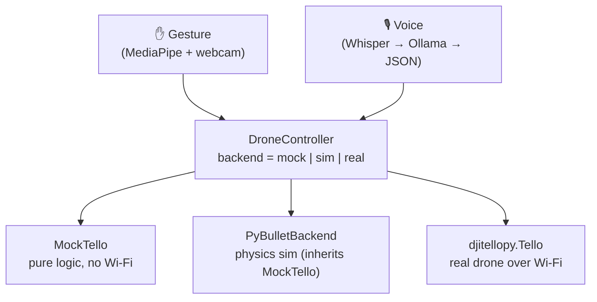

# Tello Control — gesture & voice control for a DJI Tello, fully local

Control a DJI Tello drone with **hand gestures** and **spoken commands** — running
**entirely on-device, no cloud**. A single backend abstraction lets the exact same
control code drive a software mock, a PyBullet **physics simulation**, or the real
drone over Wi‑Fi. So the whole system can be developed and tested **without any
hardware**.


> 📄 **Full technical write-up:** [`docs/PROJECT.pdf`](docs/PROJECT.pdf) — what every
> component does, which libraries are used and how they connect.

<!-- TODO: add a demo GIF here (gesture or voice flight against the simulation). -->

---

## Why this project

- **Hardware-optional by design.** A `DroneController` hides the backend, so the
  same gesture/voice code runs against a mock, a physics sim, or the real Tello —
  switching is a single argument.
- **Edge / privacy-first.** Speech-to-text (Whisper), the command-parsing LLM
  (Ollama) and gesture recognition (MediaPipe) all run locally. No internet is
  needed during flight.
- **Breadth:** computer vision, speech recognition, a local LLM, classical control
  (PID) and real hardware integration in one coherent system.

## Architecture



The code above the controller never knows which backend is running.

## Features

| Module | What it does | Key tech |
|--------|--------------|----------|
| **Core** (`tello_control.core`) | Backend abstraction + software drone with pose tracking, command log and SDK safety bounds | pure Python |
| **Gesture** (`tello_control.gesture`) | Webcam → hand landmarks → angle-based classifier → debounced commands (runs in a worker thread) | MediaPipe, OpenCV |
| **Voice** (`tello_control.voice`) | Mic → energy VAD + wake word → speech-to-text → local LLM → validated JSON commands | faster-whisper, Ollama (`qwen2.5:3b`) |
| **Sim** (`tello_control.sim`) | Real quadrotor physics in a 3D window + a PID step-response lab | PyBullet / gym-pybullet-drones |

## Performance

Measured on MacBook Air M1 (no GPU), all models running on CPU:

| Metric | Typical value | Notes |
|--------|--------------|-------|
| Gesture detection | ~15 FPS | MediaPipe CPU inference |
| Voice latency (Whisper) | ~1.2 s | `small` model, int8 |
| LLM parse latency (Ollama) | ~0.8 s | `qwen2.5:3b`, local |
| Mock test suite | ~1 s | 49 tests, no hardware |

## Quickstart

```bash
# 1. main environment (mock / real drone / gestures / voice)
python -m venv venv && source venv/bin/activate
pip install -e .

# 2. one-time: download the MediaPipe hand model (~7.5 MB, git-ignored)
python scripts/download_model.py

# 3. try it — no hardware needed
python examples/demo.py cube            # mock cube flight in the terminal
tello-gesture                           # gesture control via webcam (mock)
tello-voice                             # voice control (needs Ollama, see below)
```

**Voice** additionally needs a local [Ollama](https://ollama.com) server with the
model pulled once: `ollama pull qwen2.5:3b` (the app starts the server itself).

**Simulation (A3)** runs in a separate conda environment because PyBullet does not
build via pip on Apple Silicon — see [`environment-sim.yml`](environment-sim.yml)
and [`docs/COMMANDS.md`](docs/COMMANDS.md).

All run commands are collected in **[`docs/COMMANDS.md`](docs/COMMANDS.md)**.

## Project structure

```
tello-projekt/
├── src/tello_control/        # the installable package
│   ├── core/                 # DroneController + MockTello
│   ├── gesture/              # MediaPipe pipeline (models/ holds the .task model)
│   ├── voice/                # Whisper + Ollama + validation
│   ├── sim/                  # PyBullet backend, demo, PID control lab
│   └── hardware/             # telemetry / flight-test scripts for the real Tello
├── examples/                 # runnable demos (cube flight, PS4 controller)
├── scripts/                  # download_model.py, webcam_check.py
├── tests/                    # hardware-free pytest suite
└── docs/                     # PROJECT.pdf, commands, diagrams, SDK reference
```

## Tests

```bash
pip install -e ".[dev]"
pytest
```

The suite is hardware-free: it covers the command-validation safety layer, the
gesture debounce/mapping logic and the MockTello pose/bounds model.

## Roadmap

- **A0 Foundation** ✅ — controller abstraction, MockTello, first real flights
- **A1 Gesture control** ✅ — MediaPipe, angle-based classifier, debounce
- **A2 Voice control** ✅ — Whisper → Ollama → validated JSON, wake word
- **A3 Physics sim** ✅ — PyBullet backend + PID lab
- **A4 Integration** ⏳ — unified app, demo video, portfolio polish

## License

MIT — see [LICENSE](LICENSE).
