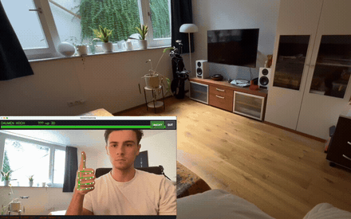
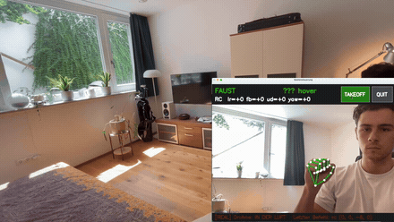
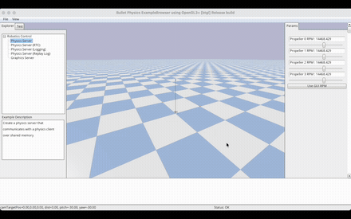
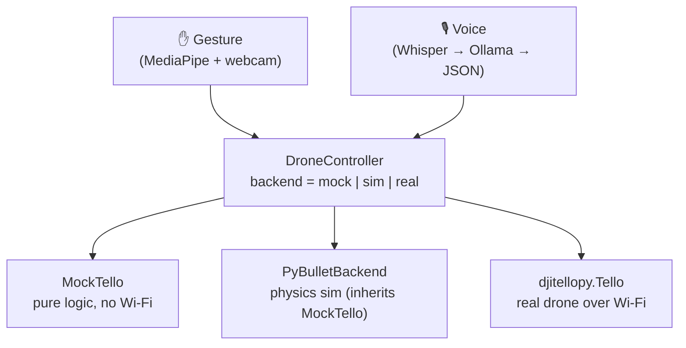

# Tello Control — gesture & voice control for a DJI Tello (fully local)

Control a DJI Tello drone with various methods, from direct inputs to gesture control to
voice commands. All functions were first tested on a mock version, then a local simulation,
and in the end on the hardware. It's meant for grasping the workflow: implementing the
libraries, sending direct commands to the hardware or the local model, and verifying the
movements. Outside of the controlling functionality, this repo is also designed to work
seamlessly with coding AI models and to run them as efficiently and performantly as possible.

[](https://github.com/MarceloElia/Tello_Project/actions/workflows/tests.yml)


> 📄 **Full technical write-up:** [`docs/PROJECT.pdf`](docs/PROJECT.pdf) — what every
> component does, which libraries are used and how they connect.

## Demo

The first three clips are real flights with the physical Tello; the last is the PyBullet
simulation.

**Gesture control** — a held hand pose maps to a discrete 30 cm move.



▶ [Full clip (46 s, with sound)](https://github.com/user-attachments/assets/d190e388-8feb-4e01-887d-ef08f4270340)

**Continuous velocity mode (`--rc`)** — the same gestures, but held poses become a
velocity setpoint via `send_rc_control` instead of discrete hops. No ACK round-trip per
command, so the drone moves the moment the gesture is recognised.



▶ [Full clip (47 s, with sound)](https://github.com/user-attachments/assets/5afec26c-a6a6-484a-98b8-738a247a553b)

**Voice control** — wake word "Drohne", then German speech → Whisper → Ollama →
validated JSON. Watch with sound; everything runs locally on the laptop.

https://github.com/user-attachments/assets/0d656712-5195-4bd6-93da-4e94c118456d

**PID step-response lab (simulation)** — the PyBullet backend overshooting a step input
before settling, used to tune the flight controller's PID gains.



---

## Why this project

In my humble opinion, drones are just way more fun to watch and control than any
ground-based robot, especially at this project's scope. So even though most ground projects
would be easier to control and carry a lower risk of crashing into a wall, that risk is the
exact reason why this is more interesting. Since I don't have a pile of these drones lying
around, I had to test everything repeatedly against the mock and the simulation to ensure
safety.

A `DroneController` hides the backend. The same gesture and voice code runs against a
software mock, a PyBullet physics simulation, or the real Tello — switching is a single
argument. Everything else follows from that one decision.

Everything also runs locally. Speech-to-text (Whisper), the command-parsing LLM (Ollama)
and gesture recognition (MediaPipe) execute on the laptop, so no internet connection is
needed while the drone is in the air.

> Design choices and what was rejected are recorded in
> [`docs/DECISIONS.md`](docs/DECISIONS.md). That includes a **lip-reading control channel
> that was built and then abandoned** — the post-mortem, with the actual garbled decoder
> output, is in [`docs/PROJECT.md` §6.1](docs/PROJECT.md).

## Architecture



The code above the controller never knows which backend is running.

## Features

| Module | What it does | Key tech |
|--------|--------------|----------|
| **Core** (`tello_control.core`) | Backend abstraction + software drone with pose tracking, command log and SDK safety bounds | pure Python |
| **Gesture** (`tello_control.gesture`) | Webcam → hand landmarks → angle-based classifier → debounced commands (worker thread). Optional `--rc` mode turns a held gesture into a continuous velocity setpoint instead of discrete 30 cm hops | MediaPipe, OpenCV |
| **Voice** (`tello_control.voice`) | Mic → energy VAD + wake word → speech-to-text → local LLM → validated JSON commands. A keyword fastpath skips the LLM for simple commands, through the same validator | faster-whisper, Ollama (`qwen2.5:3b`) |
| **Sim** (`tello_control.sim`) | Real quadrotor physics in a 3D window + a PID step-response lab | PyBullet / gym-pybullet-drones |
| **Controller** (`examples/ps4_controller.py`) | Gamepad sticks → continuous `send_rc_control` setpoints, zeroed on release and before landing. Talks to `djitellopy.Tello` directly, so unlike the modes above it flies the **real drone only** — no mock, no sim | pygame |

## Quickstart

```bash
# 1. main environment (mock / real drone / gestures / voice)
python -m venv venv && source venv/bin/activate
pip install -e .

# 2. one-time: download the MediaPipe hand model (~7.5 MB, git-ignored)
python scripts/download_model.py

# 3. try it — no hardware needed
python examples/demo.py cube            # mock cube flight in the terminal
tello-gesture                           # gesture control via webcam (mock)
tello-voice                             # voice control (needs Ollama, see below)
```

**Voice** additionally needs a local [Ollama](https://ollama.com) server with the
model pulled once: `ollama pull qwen2.5:3b` (the app starts the server itself).

**Simulation (A3)** runs in a separate conda environment because PyBullet does not
build via pip on Apple Silicon — see [`environment-sim.yml`](environment-sim.yml)
and [`docs/COMMANDS.md`](docs/COMMANDS.md).

All run commands are collected in **[`docs/COMMANDS.md`](docs/COMMANDS.md)**.

## Project structure

```
tello-projekt/
├── src/tello_control/        # the installable package
│   ├── core/                 # DroneController + MockTello
│   ├── gesture/              # MediaPipe pipeline (models/ holds the .task model)
│   ├── voice/                # Whisper + Ollama + validation
│   ├── sim/                  # PyBullet backend, demo, PID control lab
│   └── hardware/             # telemetry / flight-test scripts for the real Tello
├── examples/                 # runnable demos (cube flight, PS4 controller)
├── scripts/                  # download_model.py, webcam_check.py,
│                             #   latency_benchmark.py, graphify_benchmark.py
├── tests/                    # hardware-free pytest suite (97 tests)
├── docs/                     # PROJECT.pdf, DECISIONS.md, COMMANDS.md, AI_WORKFLOW.md
├── .claude/skills/           # the slash-commands used to build this (see below)
└── AIDER.md + .aider.conf.yml  # task gate for the local coding model
```

## Tests

```bash
pip install -e ".[dev]"
pytest
```

97 tests, ~1.8 s, no hardware: they cover the command-validation safety layer, the
gesture debounce/mapping and velocity-blending logic, the voice fastpath and energy
segmenter, and the MockTello pose/bounds model. No webcam, microphone, drone or
PyBullet is needed, so the whole suite runs in CI.

## How this was built

The repo ships the AI tooling used to build it, because the layering is part of the
design. Each layer does the thing it is actually good at.

```
Claude Code (VS Code)
      │
      ├── Skills          /scaffold-here · /graphify · /generate_gate · /aider-compact
      │                   reproducible routines, committed in .claude/skills/
      │
      ├── graphify        repo → knowledge graph. An index over code + docs:
      │                   "where is X, what touches it" — not "how does X work"
      │
      └── generate_gate → AIDER.md, a task gate defining what the local model may touch
                                │
                                └── Aider + qwen2.5-coder:3b — local, no API tokens
```

**Skills** (`.claude/skills/`) are slash-commands with a `SKILL.md` instruction file.
`/scaffold-here` generated the installable layout (`src/` package, console-scripts,
`tests/`, `docs/`). `/generate_gate` writes `AIDER.md`, which bounds what the local 3B
model is allowed to attempt; anything multi-file or async is explicitly held for Claude.

**graphify** ([`graphifyy`](https://pypi.org/project/graphifyy/)) indexes the repo into a
graph — 537 nodes, 807 edges, 38 communities — with an EXTRACTED/INFERRED audit trail.
`MockTello` and `DroneController` fall out as the central hubs, which is the intended
shape. The graph is a regenerable artifact (`graphify-out/`, git-ignored): `graphify
update` is AST-only, though the initial build runs a semantic LLM pass and does cost tokens.

**What the graph is worth, measured.** [`scripts/graphify_benchmark.py`](scripts/graphify_benchmark.py)
runs five pre-registered orientation questions and compares graphify's output against
reading the files that answer them:

| | |
|---|---|
| Median context saving | **≈ 4.8×** (range 3.5–22×) |
| Questions answered outright | **0 of 5** |
| Questions merely *located* | 4 of 5 |
| Questions answered wrongly | 1 of 5 |

The honest reading: graphify is an **index, not an oracle**. It cuts the cost of finding
the right file, and it never contains the code, so implementation detail still means
opening the file. The cheapest query in the benchmark (147× "saving") is the one that
matched the wrong nodes entirely — which is exactly why token count alone is a bad
metric, and why the sufficiency column exists. `graphify query` at its default
`--budget 2000` is *not* cheaper than simply reading a small module.

Note that cloning this repo inherits the `PreToolUse` hooks in `.claude/settings.json`,
which nudge an agent to run `graphify query` before grepping. Delete them if unwanted.

> Full workflow write-up (German): [`docs/AI_WORKFLOW.md`](docs/AI_WORKFLOW.md)

## License

MIT — see [LICENSE](LICENSE).
